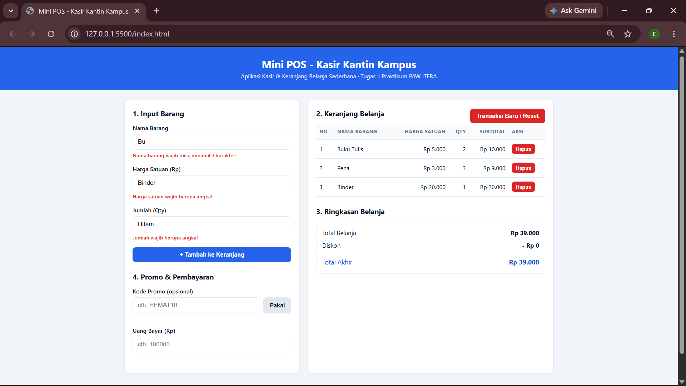
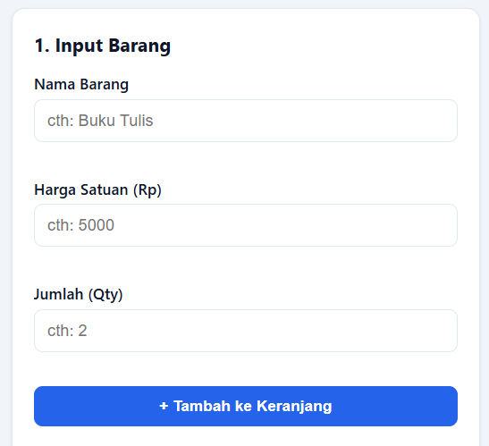
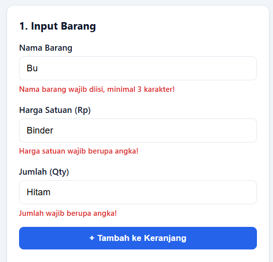
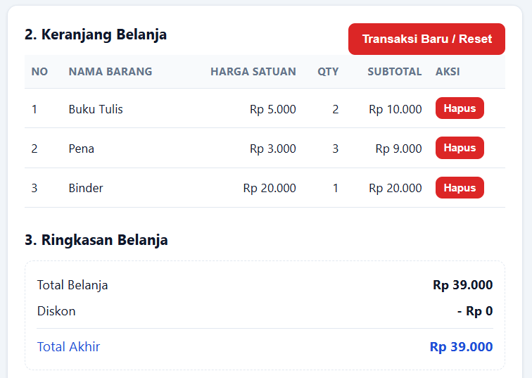

# Mini POS - Aplikasi Kasir & Keranjang Belanja Sederhana

Tugas Praktikum Pertemuan 1 - Pengembangan Aplikasi Web (PAW), Teknik Informatika ITERA

## Identitas

- **Nama Lengkap:** Erhan Kurniawan
- **NIM:** 124140217
- **Kelas Praktikum:** RA 

## Deskripsi Aplikasi

Mini POS adalah aplikasi web kasir dan keranjang belanja sederhana untuk kantin/toko
kampus. Aplikasi ini menyatukan tiga kompetensi dasar praktikum: validasi input form,
perhitungan kalkulator otomatis (subtotal, total, diskon, kembalian), dan manajemen
keranjang belanja berbasis localStorage sehingga data tidak hilang saat halaman di-refresh.

## Panduan Menjalankan

1. Clone repository ini: `git clone https://github.com/hanxx166/pemrograman_web_itera_124140217.git`
2. Buka folder `ErhanKurniawan_124140217_pertemuan1` di VS Code.
3. Klik kanan `index.html` → **Open with Live Server** (atau buka langsung di browser,
   aplikasi tidak membutuhkan server karena tidak memakai Fetch API).
4. Pastikan folder `modul/` (berisi latihan 1-4) juga tersedia di dalam direktori proyek sebagai bukti penyelesaian materi praktikum dasar.

## Daftar Fitur

- [x] Validasi form: nama barang minimal 3 karakter, harga minimal Rp 500, qty bulat minimal 1
- [x] Pesan error merah di bawah input yang salah & barang tidak masuk keranjang
- [x] Form otomatis reset setelah barang berhasil ditambahkan
- [x] Subtotal otomatis per baris (harga × qty)
- [x] Total belanja otomatis dari seluruh subtotal
- [x] Diskon otomatis 10% jika total ≥ Rp 50.000 + kode promo HEMAT10
- [x] Kalkulator uang bayar & kembalian (termasuk pesan uang kurang)
- [x] Tabel keranjang: No, Nama Barang, Harga Satuan, Qty, Subtotal, Aksi
- [x] Tombol Hapus per baris dengan perhitungan ulang otomatis
- [x] Penyimpanan persisten localStorage (JSON.stringify / JSON.parse)
- [x] Tombol Transaksi Baru/Reset (kosongkan keranjang + bersihkan localStorage)
- [x] Format Rupiah (Intl.NumberFormat) dan tampilan responsif

## Tangkapan Layar

| No | Screenshot | Keterangan Fitur |
| :--- | :--- | :--- |
| 1 |  | Tampilan penuh aplikasi Mini POS |
| 2 |  | Form input barang dengan placeholder panduan pengguna |
| 3 |  | Validasi form: Pesan error merah muncul saat input tidak sesuai syarat |
| 4 |  | Tabel keranjang, subtotal otomatis, dan ringkasan total + diskon |

## Penjelasan Teknis Singkat

### Penanganan Validasi Input

Fungsi `validasiForm()` memeriksa ketiga input satu per satu. Setiap kegagalan menulis
pesan ke elemen `<small class="error-message">` di bawah input terkait dan mengembalikan
`null`, sehingga `tambahBarang()` berhenti sebelum barang masuk keranjang.

### Algoritma Kalkulator Keuangan

`hitungTotalBelanja()` mengakumulasi subtotal (`harga × qty`) dengan `reduce()`, lalu
menentukan diskon: 10% diberikan jika kode promo 'HEMAT10' valid dimasukkan, atau secara otomatis jika total belanja mencapai minimal Rp 50.000 tanpa kode promo.
`hitungKembalian()` menghitung `uangBayar − totalAkhir`; jika negatif, ditampilkan
pesan "uang belum mencukupi" beserta nominal kekurangannya.

### Mekanisme Serialisasi localStorage

Array objek keranjang disimpan dengan `localStorage.setItem(KEY, JSON.stringify(keranjang))`
setiap ada perubahan (tambah/hapus/reset), dan dimuat ulang saat halaman dibuka dengan
`JSON.parse(localStorage.getItem(KEY))`, sehingga isi keranjang bertahan setelah refresh.
